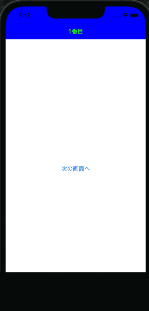

## 概要

- SwiftUIでナビゲーションバーを配置するために、見た目上一番うまくいった方法

- NavigationBarの背景色は、ZStackでColorをナビゲーションバーが表示される位置に配置する
- NavigationBarのタイトル色やtintcolorは、`UINavigationBar.appearance()`で指定する

- とりあえずSwiftUIでのナビゲーションバーのUI周りの設定は色々と面倒ということが分かった・・・ 

- 成果物

